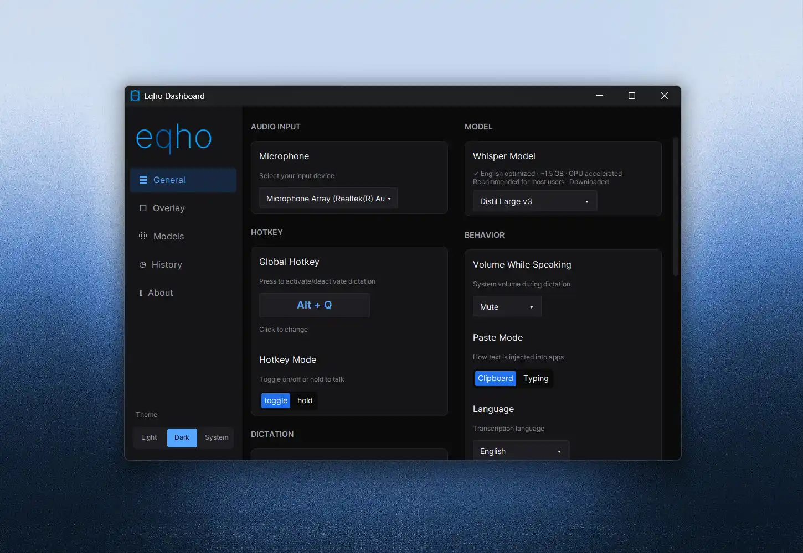

<picture>
  <source media="(prefers-color-scheme: dark)" srcset="logo/logo_horizontal_dark.png">
  <source media="(prefers-color-scheme: light)" srcset="logo/logo_horizontal_light.png">
  
</picture>

# Eqho — free, offline voice-to-text dictation

**Speak anywhere Windows lets you type.** Press a hotkey, talk, and your words appear in whatever app is focused — Word, your browser, Slack, code editors, anything. Powered by OpenAI's Whisper (via [faster-whisper](https://github.com/SYSTRAN/faster-whisper) and [whisper.cpp](https://github.com/ggml-org/whisper.cpp)), running **100% on your machine** — accelerated on any modern GPU: **NVIDIA, AMD, or Intel**.

[](https://www.gnu.org/licenses/agpl-3.0)
[](#install)

- 🔒 **Private by design** — no cloud, no account, no API key. Your voice never leaves your computer.
- ⚡ **Fast on any GPU** — NVIDIA (CUDA), **AMD and Intel (Vulkan)**, or CPU. Eqho auto-detects your hardware and picks the fastest local engine; real-time preview as you speak.
- 🆓 **Free and open source** — no subscription, no word limits, ever.
- 🌍 **13 languages** — English-optimized by default, multilingual models one click away.

 

## Install

**Windows (recommended):** grab `Eqho-Setup-<version>.exe` from [Releases](https://github.com/danielmevit/eqho/releases) → double-click → done. Prefer no installer? Use the portable `.zip`.

**Linux / macOS:** download the `.tar.gz` / `.dmg` from Releases (core dictation supported since v0.6.0 — see [platform notes](#platform-notes)).

**From source:**

```bash
git clone https://github.com/danielmevit/eqho.git
cd eqho
python -m venv venv && venv\Scripts\activate   # Windows
pip install -r requirements.txt
python run.py
```

First run downloads the default speech model (distil-large-v3, ~1.5 GB) — after that, everything is offline.

## How it works

1. Click into any app where you want text.
2. Press **Alt+Q** — a floating bar shows "Listening…".
3. Speak naturally. Watch the live transcription preview.
4. Press **Alt+Q** again — your words are typed into the app.

Toggle or hold-to-talk, your choice. The hotkey is customizable.

## Features

- **Dictation into any application** via clipboard paste or simulated typing
- **Live transcription overlay** with adjustable position and opacity
- **Settings dashboard** — dark, light, and system themes
- **Transcript history** — searchable, exportable, stored locally, one-click clear
- **Custom vocabulary** — teach it your names and jargon
- **Voice commands** — "new line", "period", "delete that" (opt-in)
- **Text replacements** — auto-correct words the model keeps missing
- **Volume ducking** — quiets your speakers while you dictate
- **Model picker** — from `tiny` (150 MB, fastest) to `large-v3` (3.1 GB, most accurate); `distil-large-v3` default hits the sweet spot for English
- **Dual-engine, cross-vendor GPU** — NVIDIA acceleration via CUDA ([faster-whisper](https://github.com/SYSTRAN/faster-whisper)) *and* **AMD / Intel / NVIDIA acceleration via Vulkan** ([whisper.cpp](https://github.com/ggml-org/whisper.cpp)), with a CPU fallback. Eqho auto-selects the best engine for your machine — or choose it yourself in **Settings → General → Inference Engine**

## Languages

English · Spanish · Mandarin · Japanese · Korean · Vietnamese · Arabic · Ukrainian · French · German · Portuguese · Russian · Italian

Distil models are English-optimized; for other languages pick `large-v3-turbo` or `medium` in the Models tab.

## Requirements

- **64-bit** Windows 10/11 (primary), Linux X11, or macOS — there is no 32-bit build; the on-device AI models require a 64-bit system
- Python 3.10+ (only when running from source)
- Optional GPU acceleration — **auto-detected, no configuration**:
  - **NVIDIA** — [CUDA Toolkit 12.x](https://developer.nvidia.com/cuda-downloads) for ~5× faster transcription (`winget install Nvidia.CUDA`)
  - **AMD & Intel** — no toolkit to install; the Windows build ships the Vulkan engine (whisper.cpp), which also runs on NVIDIA

## Platform notes

- **Linux:** needs `libportaudio2`, `xclip`, and an AppIndicator library for the tray; global hotkeys and text injection target X11 (Wayland is on the roadmap).
- **macOS:** grant Eqho **Accessibility** and **Input Monitoring** in System Settings → Privacy & Security; first launch of the unsigned app is right-click → Open.
- Unsigned Windows binaries show a SmartScreen prompt on first run — "More info" → "Run anyway". Code signing is planned.

## FAQ

**Is my audio uploaded anywhere?** No. Transcription runs locally via CTranslate2. The only network access is the one-time model download.

**Does it cost anything?** No. Free, open source, no premium tier.

**Does it work on AMD or Intel GPUs?** Yes. Besides the NVIDIA (CUDA) engine, Eqho ships a cross-vendor **Vulkan engine (whisper.cpp)** that accelerates dictation on **AMD Radeon** and **Intel Arc / Iris** graphics — and NVIDIA too. Eqho detects your hardware and picks the fastest engine automatically; you can also set it manually under Settings → General → Inference Engine.

**How accurate is it?** Whisper-class accuracy — state of the art for open speech recognition. Pick a bigger model for tougher audio.

**Where are my settings and history?** In your user config folder (`%APPDATA%\Eqho` on Windows) — never in the cloud.

## Configuration & docs

Settings persist to `settings.json` in your config folder — everything is also adjustable from the tray menu and dashboard. For development docs, see `AGENTS.md`, `docs/ai/`, `ROADMAP.md`, and `CHANGELOG.md`. The repo is CodeGraph-indexed (`codegraph init` after cloning).

## License

Eqho is licensed under the [GNU AGPL-3.0](LICENSE): free to use, study, and modify — if you redistribute it or a derivative (including as a network service), you must keep the copyright and attribution notices and release your version under the same license. © [Daniel Mevit](https://github.com/danielmevit).

Made by **[damt.xyz](https://damt.xyz)** — freelance design & development.

Provided "as is", without warranty of any kind.

---

<sub><b>Keywords:</b> speech to text · voice to text · dictation software · offline speech recognition · free dictation app · voice typing for Windows · OpenAI Whisper app · whisper.cpp GUI · faster-whisper GUI · private speech to text · local voice recognition · no-cloud transcription · talk to type · voice keyboard · speech recognition without internet · dictate into any app · Dragon NaturallySpeaking alternative · Windows Voice Access alternative · open source dictation · GPU accelerated transcription · CUDA speech to text · Vulkan speech to text · AMD GPU dictation · AMD Radeon voice to text · Intel Arc dictation · Intel GPU speech recognition · cross-vendor GPU transcription · Whisper on AMD · runs on any GPU · real-time transcription overlay · hands-free typing · accessibility voice input · multilingual dictation</sub>
